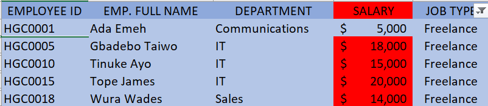
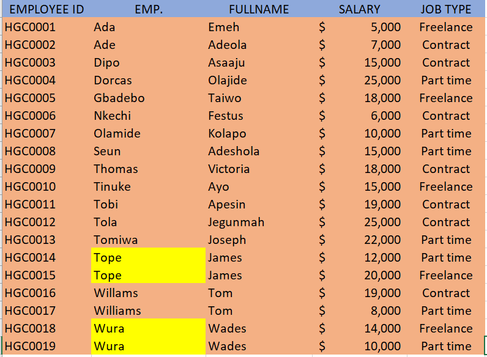
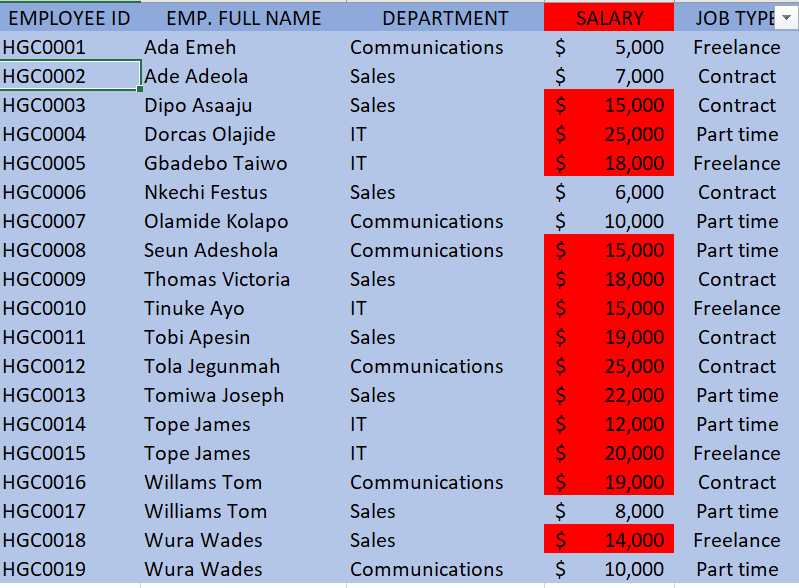
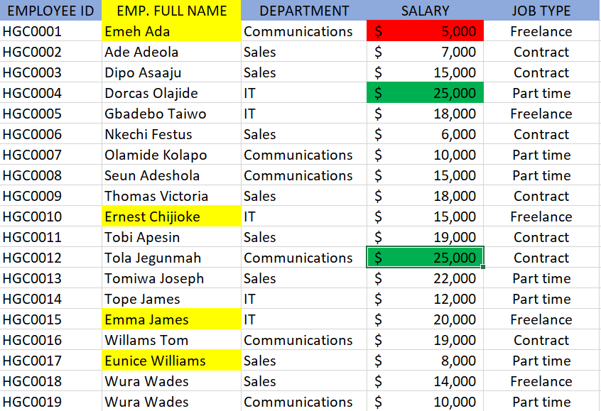

# Hydrogen-Group.Com

---

## Introduction

This is a mini project in excel on an imaginary company called "Hydrogen GROUP OF COMPANIES". 
This project is to show and highlight employees.
**-Disclaimer_**: _All datasets and highlights do not represent any company, institution or country, but just
an imaginative datasetsto demonstrate excel capabilities._

## Statement
In this worksheets, i created a table with 20 rows of Hydrogen group of companies information
having the fields below
-Employee ID
-Employee fullnames
-Department (Communications,Sales,IT)
-Salary (between $5000 - $25000)
-Job type (Part-time, Freelancer, Contracrt)

## Skills / Concepts

The following Excel features were incorporated-
-Conditional formating, 
-Data duplication, 
-Filters.

## Steps

Copy and paste table into worksheet 2 and worksheet 3
-In worksheet 1, Show only employees who are 'Freelancers and highlight 
the ones whose salaries are above $10000
-In worksheet 2, split the employees' full names into first name and last name. 
Check for duplicates and highlight if any (do not delete)
-In worksheet 3, highlight employees whose names begin with the letter 'E' (in yellow). 
-Format the Salary column such that the highest SALARY has a green background and the lowest SALARY has a red 
background.

##Images

